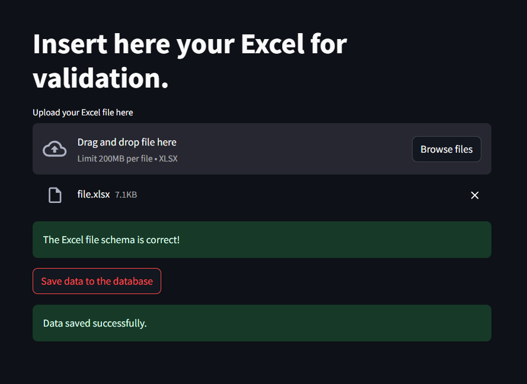

# Validator-schema-excel

Este é um projeto em Python que oferece uma aplicação web usando Streamlit como frontend, um backend para validar arquivos Excel com base em um esquema predefinido e salvar em banco de dados.

## Deploy

## Database

Foi usado uma instância `PostgreSQL` na cloud. Banco de dados utilizado para armazenar os dados validados, hospedado gratuitamente na [Render](https://render.com/).

## Funcionalidades Principais

- **Frontend Intuitivo**: Utiliza o framework `Streamlit` para fornecer uma interface web amigável e bonita. É Fácil e rápido de construir para qualquer tipo de desenvolvedor, além de possibilitar um deploy sem custos.
- **Validação de Arquivos Excel**: Permite aos usuários carregar arquivos Excel e valida-os em conformidade com um schema predefinido no projeto.
- **Salvamento Seguro de Dados**: Se os dados no arquivo passarem pela validação com sucesso, são salvos com segurança para posterior processamento dentro do banco de dados.

## Principais Tecnologias Utilizadas

- Python: Linguagem de programação principal para desenvolvimento do backend e lógica de validação.
- Streamlit: Utilizado para criar o frontend web interativo.
- Pandas: Biblioteca utilizada para manipulação de dados no formato Excel.
- Pytest: Utilizado para executar testes de integração, unitários e funcionais da aplicação.
- [Sentry.io](https://render.com/): Fornece a observabilidade do logging do projeto. O Sentry permite o monitoramento proativo de erros e exceções em tempo real, fornecendo insights valiosos sobre o desempenho e a estabilidade da aplicação.

## Contribuição

Contribuições são bem-vindas! Se você deseja melhorar este projeto, sinta-se à vontade para abrir uma issue ou enviar um pull request.

## Licença

Este projeto é licenciado sob a MIT License.
